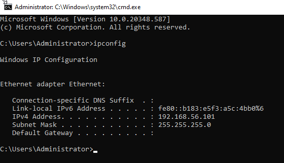
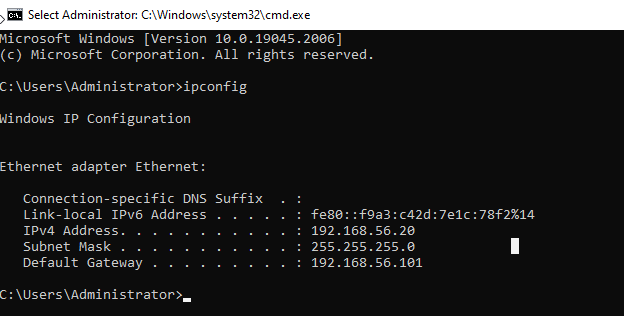
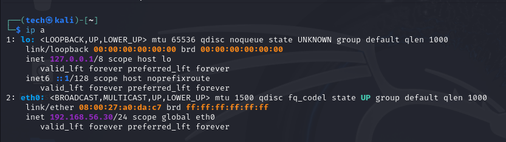
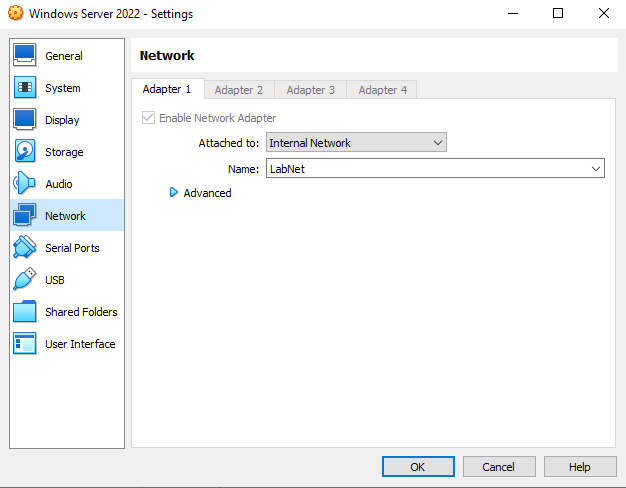
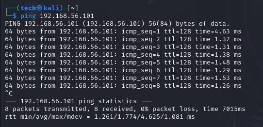
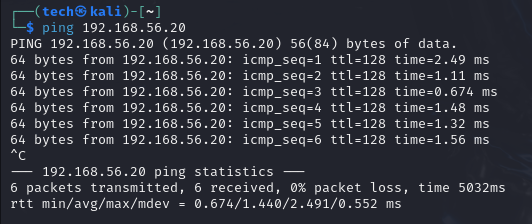

# Network Configuration

All machines are connected to the same isolated VirtualBox **Internal Network** named `LabNet`.

## Network Type
- VirtualBox Network Mode: Internal Network
- Name: `LabNet`
- Subnet: `192.168.56.0/24` (manually assigned IPs)

## IP Address Allocation

| Hostname       | Role              | IP Address       | OS                   |
|----------------|-------------------|------------------|----------------------|
| `WIN-DC01`     | Domain Controller | 192.168.56.101   | Windows Server 2022  |
| `WIN10-CLIENT` | Domain Client     | 192.168.56.20    | Windows 10 Enterprise|
| `kali`         | Attacker (Kali)   | 192.168.56.30    | Kali Linux           |

## Manual IP Configuration

Static IPs were manually assigned using:

- Control Panel → Network → IPv4 settings on Windows
- `ip addr add` on Kali

## Firewall Adjustments

To allow internal traffic (especially ping and SMB):
- **Windows Defender Firewall disabled** on:
  - Windows 10
  - Windows Server

 ## 🔍 Network Configuration Screenshots

### 🖥️ Domain Controller IP (`ipconfig`)

### 💻 Windows 10 IP (`ipconfig`)

### 🧑‍💻 Kali IP (`ip a`)

### 🔧 VirtualBox Network Config (Server)

### 📡 Ping Test from Kali to DC

### 📡 Ping Test from Kali to Win10

